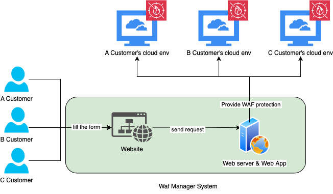

# AI Guardian
## Propose

During our internship at company, we encountered a significant challenge in the realm of web application security: the complex and time-consuming process of setting up a Web Application Firewall (WAF). This task, critical for protecting web applications from various cyber threats, often proves to be a frustrating and resource-intensive endeavor for many organizations.

## Usage
AWS Cognito integration offers secure, scalable authentication for login pages. It manages our accounts and provides sign-up and sign-in functionality.

AI Guardian's key feature is chat-based WAF creation. This approach makes web security setup simple and accessible, allowing users of all skill levels to configure protection through natural conversation.

AI Guardian streamlines WAF setup compared to traditional methods like AWS WAF console. Its chat interface allows quick configuration, enabling experienced users to complete the entire process in seconds. This manual yet conversational approach balances ease of use with efficient customization for web security.

## CLoud Infraustructure
Detailed description for cloud architecture can be found in our [document](docs/document.md). 

