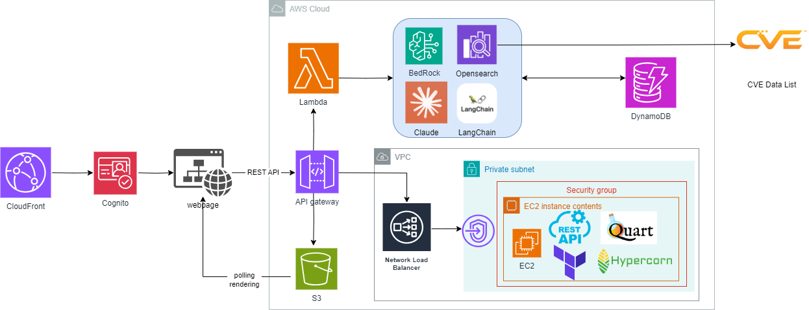
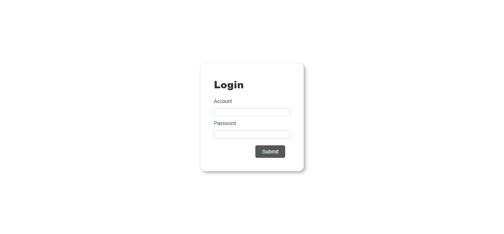
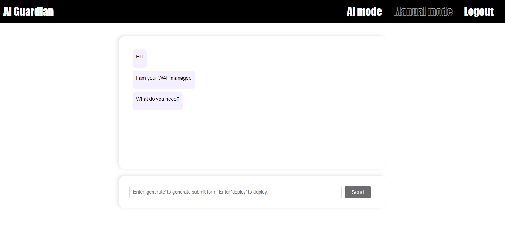
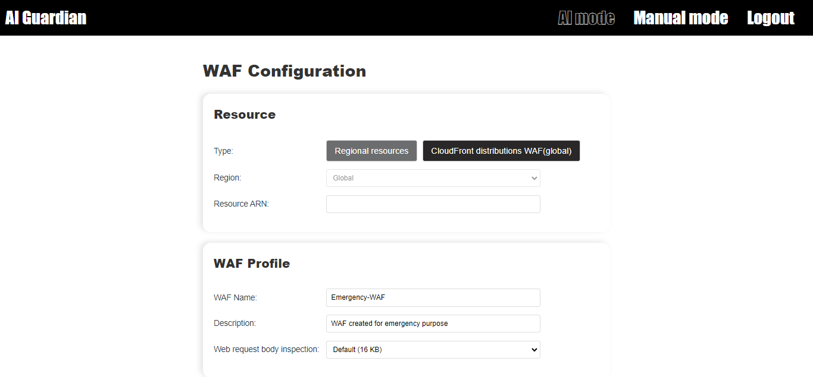

# AI Guardian
During our internship at company, we encountered a significant challenge in the realm of web application security: the complex and time-consuming process of setting up a Web Application Firewall (WAF). This task, critical for protecting web applications from various cyber threats, often proves to be a frustrating and resource-intensive endeavor for many organizations.

The login page will be integrayed with AWS Cognito.

The main feature of AI Guardian. Build WAF through chatting is friendly to everyone.

Manual setup a WAF. It's more easier to configure than the AWS WAF configuration console. A veteren can speed run the whole setting process in a few seconds.
